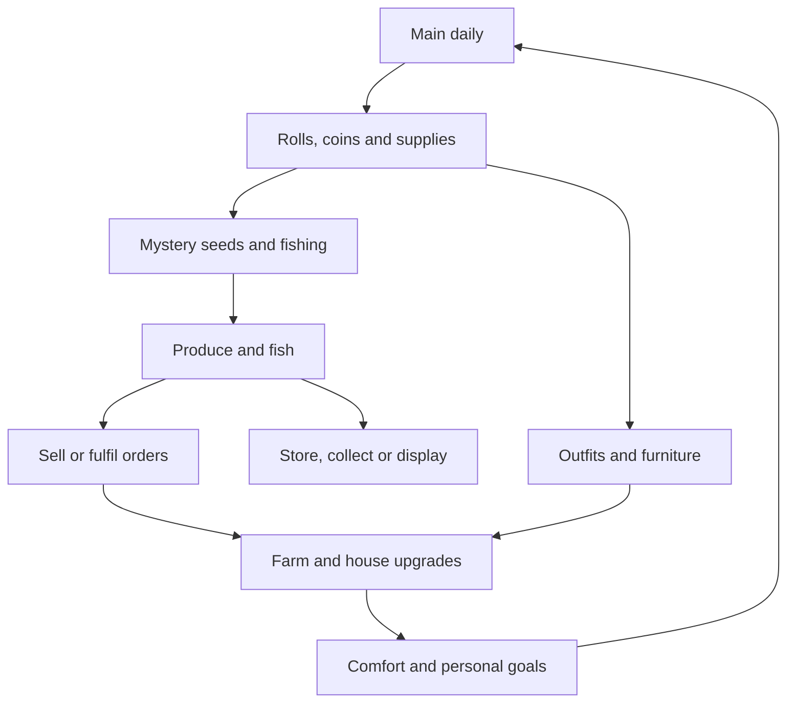

# My lime: farm, fishing and home

Research/design checkpoint: **6 October 2026**. This is the owner's latest direction. It supersedes the earlier isometric-room-plus-arcade proposal for future development. The existing Guess people-v2 and room/reward pilot remain implemented; this document does **not** claim the farm is implemented or change the development database.

Companion files: [roadmap](PROJECT_ROADMAP.md), [farm asset contract](FARM_ASSET_GUIDE.md), [economy inputs](research/farm-economy-inputs.json), [reproducible model](research/farm-economy-model.py), [results](research/farm-economy-results.json). All prices/rates below are pilot hypotheses, not immutable user decisions.

## The intended experience

**Your daily games help you build a little place of your own.** Create a character, walk around your farm, plant mystery seeds, catch fish, sell or keep discoveries, improve the house and come back with another roll from Guess Nah. Start single player. The house is a walkable interior with useful props and expressive decoration; the exterior is a place to inhabit rather than a menu of timers.

Use Stardew-adjacent **top-down, three-quarter sprites on a square orthogonal map**, a following camera, eight-direction movement with four sprite facings, foot-level collisions and a door transition into a separate house scene. Replace the earlier diamond-grid isometric art direction. Keep original character designs, scenery and UI rather than reusing Stardew sprites, characters, audio or place names.

The first world can be one 64×48-tile farm containing a house, a six-plot starter patch, a pond/dock, shipping counter, seed stall and noticeboard. House entry changes to a 10×8 walkable interior. An original Caribbean yard can use local colour, a verandah, garden beds and familiar produce; four temperate seasons are unnecessary. A shore scene, NPC relationships, livestock, combat, a town, procedural terrain and multiplayer do not belong in the first working slice.

The important connection is **dailies → resources/discoveries → useful choices → a better-looking farm/home → another reason to play**. Farming remains enjoyable independently. Main games provide stronger collection access and faster progress without determining whether a crop survives.

## What the research actually supports

The official Stardew website links its community wiki. Wiki pages below are first-hand mechanic documentation, sometimes citing game methods, not a popularity study or a design recommendation from ConcernedApe. Technical recommendations use official engine/database documentation. Sources were checked on 6 October 2026; observations and our proposed adaptations are separated.

| Source | Observed mechanic | Proposed BMT use |
| --- | --- | --- |
| [Stardew official features](https://www.stardewvalley.net/) | Farming, fishing, character customisation and home decoration share a farm-life experience | One character connects outdoor play, the house and collection rewards |
| [Mixed Seeds](https://stardewvalleywiki.com/Mixed_Seeds) | Planting resolves a random crop from a defined pool, with season/location affecting that pool | A disclosed mystery seed pool and a server-frozen crop; BMT deliberately delays species reveal until maturity |
| [Shipping](https://stardewvalleywiki.com/Shipping) | Produce has a selling route, different qualities and a shipping collection | A clear sell destination and collection journal; BMT pays immediately after confirming the sale |
| [Bundles](https://stardewvalleywiki.com/Bundles) | Consumed donations complete sets and earn rewards; some bundles accept a choice among more items than required | Flexible farm/fishing requests and one-time collection projects, with several eligible ingredients |
| [Quests](https://stardewvalleywiki.com/Quests) | Story tutorials, item requests and prize-ticket rewards give goods uses beyond selling | Short onboarding, weekly orders and bounded access to outfit/furniture rolls |
| [Preserves Jar](https://stardewvalleywiki.com/Preserves_Jar) | Raw goods become higher-value artisan goods after processing | Later pepper sauce, preserves and prepared-fish recipes, with limited stations and an explicit cost/time decision |
| [Fish Pond](https://stardewvalleywiki.com/Fish_Pond) | Keeping fish enables another progression/product system | Later an aquarium/pond collection; reproducing fish is a separate economy expansion, not a free duplicate printer |
| [Farmhouse](https://stardewvalleywiki.com/Farmhouse) | Purchased expansions add space and facilities | Coin-purchased house size, kitchen and storage upgrades with visible practical benefits |
| [Fishing](https://stardewvalleywiki.com/Fishing) | Casting and a catch minigame produce a species reveal and collection records; pools vary by conditions | One short readable catch interaction, a discovery reveal and later distinct pond/shore pools |
| [Nintendo's New Horizons tips](https://play.nintendo.com/news-tips/tips-tricks/animal-crossing-new-horizons-discover-tips/) | Home interiors receive Happy Home Academy ratings; landscaping contributes to island progression | A transparent home score and decorating goals. Our coin multiplier is a BMT proposal, not a claimed Animal Crossing mechanic |
| [Palia developer design philosophy](https://support.palia.com/hc/en-us/articles/7474545281556-Game-Design-Philosophy) | The home is central to identity; skill rewards can unlock meaningful decor | Show the results of play at home rather than putting all progress into higher numbers |
| [Palia Home Tours introduction, patch 0.182](https://palia.com/news/patch-182) | Instanced submitted homes and weekly visit challenges offer a later social layer | Read-only farm snapshots can precede simultaneous multiplayer. This is a historical feature reference, not a claim about current ticket amounts |

The useful combination is our inference: **Stardew's physical farm loop, mystery discoveries, several uses for goods and Nintendo/Palia-style home identity**, connected to BMT's cultural dailies. No cited game proves that these rates, retention or browser performance will work here. We need a small playable loop and real player/device evidence.

## Start and daily flow

First creation provides free skin/eye/hair colours, several basic hairstyles and outfits, a home, six plots, basic tools, six mystery seeds, 90 coins and three collection rolls. Existing owners retain balances/items/receipts; the farm starter grant must occur once, using a new grant key rather than repeating the existing welcome credit. Identity colours stay free; later hairstyles and outfits add options. One original neutral body rig keeps the first art batch manageable. Body types require compatible clothing/action frames before being offered.

On the first visit, plant and water one seed, catch one fish with a gentle tutorial, see the species reveal, open a roll and equip/place its outcome, then see today's main challenge and tomorrow's harvest. The first tutorial crop can mature after a clearly labelled short tutorial duration; it must use a separate one-time tutorial grant and cannot become a repeatable fast-growth source. Normal crops use the published timer.

On a returning visit: harvest ready crops, inspect discoveries, keep or sell them, complete a main daily, collect its resources, replant, fish if wanted and spend on one personal goal. A short check-in should work; decorating/fishing can support a longer session. Never require the full checklist to receive a main-game reward.

## Two currencies, several kinds of inventory

| Resource | How it enters | What it buys/does |
| --- | --- | --- |
| **Lime Coins** | Main games, produce/fish sales, orders and existing duplicate compensation | Mystery seeds, farm/house/tool upgrades, storage, basic furniture and direct chosen decor |
| **Rolls** | Main completions/streak milestones; a bounded number of weekly farm/fishing orders and finite collection milestones | A chosen outfit or furniture collection, retaining separate guarantees |
| Seeds | Coin purchases, starter/restock supplies, main rewards and discovery milestones | Planting consumes one; an outcome is hidden until maturity |
| Crops/fish | Harvests or successful catches | Sell, store, deliver, donate or reserve for a display/recipe |
| Bait/catch allowance | Daily restock, a main-game supply bonus and optional purchased bait | Free catches first; extra fishing can consume purchased bait rather than requiring a hard play limit |

Coins and rolls remain separate spendable balances. Seeds, goods, bait and discoveries are inventory/progression, not more exchangeable currencies. No unrestricted coin-to-roll shop or raw-produce-to-roll exchange is proposed. This keeps an important reason to play the main games while letting farming fund farm improvements.

The primary daily bundle is proposed as **1 roll + 30 coins + 4 mystery seeds + 4 extra free catches**, once per Trinidad date, win or loss. Everyone can claim **2 basic mystery seeds and 6 free catches** per active date. Restocks are per-account grants, not rewards for opening multiple tabs. The main bundle tops up that date's free catch allowance from six to ten; it does not grant four separately reusable sessions. Additional inventory-producing fishing can use purchased bait as described below. Daily grants are claimed within their date; ordinary purchased/earned inventory persists. No automatic accumulation of weeks of unclaimed free catches is assumed.

Only published, server-owned main results qualify. Guess has that foundation. Where/Draw must finish their result-authority work before they can mint these bundles. Initially there is one qualifying main mode; later modes can share the first-main supply bundle and receive bounded additional rolls/coins. Do not accidentally give a second full seed/bait grant for each new mode. Mode incentives and platform budgets require another model when those modes are ready.

The current Pan daily remains the implemented historical pilot. The proposed farm version should put Pan and future side activities under one explicit side-reward budget, preserve already-earned receipts and avoid applying a new farm multiplier to old rewards retroactively. Pan/crops/fish must not maintain the **main-game** streak bonus. A separate main-activity record is required because the current completion-streak table also includes Pan.

## Mystery farming with a delayed reveal

Plant consumes a seed and freezes its pool version and random species in private server state. Water once starts a normal **24-hour** timer. Ordinary growth continues offline, without repeated watering, crop death or an expiring harvest. Repeated water requests do not shorten the timer or mint more progress. The model assumes all crops are watered at planting. The client displays elapsed progress from server timestamps; changing the local device clock cannot mature a crop.

For the first version, regular seed types have the same growth duration and generic pre-maturity stages. Otherwise the timer, crop-shaped sprite, inventory metadata or response could reveal the supposedly hidden result early. At maturity, the crop's actual appearance/name/rarity appears. Harvest transfers it to inventory atomically and empties the plot. Replanting, abandoning a crop or reloading never rerolls an existing seed outcome. The seed cost, possible outcomes and odds are visible before purchase; uncertainty is about which disclosed outcome grew.

Example balancing pool, **not approved agricultural data or a final seed catalogue**:

| Tier | Regular seed probability | Example produce | Base sale per unit |
| --- | ---: | --- | ---: |
| Common | 70% | Tomato, ochro, corn, bodi | 14 coins |
| Rare | 24% | Hot pepper, pumpkin | 20 coins |
| Epic | 5% | Sorrel | 32 coins |
| Legendary | 1% | Pineapple | 50 coins |

A regular mystery seed costs **10 coins**; every base outcome sells for more than its purchase cost. The unmodified expected sale is **16.7**, or **6.7 net coins per purchased seed**, before time, supplies, quests or bonuses. Species within each illustrated tier are equally weighted. These labels describe game drops, not real-world scarcity. Tropical growing times are deliberately compressed for a game. The eight examples exist to model arithmetic; a sustained collection needs more reviewed species, recipe uses and original art.

A species' drop rarity and a specimen's future quality are different fields. Keep quality out of the first loop; later Normal/Good/Excellent quality can express care/skill without relabelling a common tomato as a legendary species. Different seed families, fertiliser, regrowth and trees can follow once this economy works. An infinite seed-maker or perpetual regrowing legendary plant would need a new supply model.

### Bad-luck protection without spoiling the mystery

Do **not** copy the current furnishing pity counters into the hidden-seed API. If a public counter resets immediately after a concealed draw, it exposes that seed's rarity; if it is hidden, exact next-draw rates become unclear. Regular seeds therefore use the stated static odds in this proposal.

Instead show a harvest discovery track. Every 20 mature harvests grants a bonus mystery seed: Rare+ at 20/40/80/100, Epic+ at 60 and Legendary at 120, repeating the 120-harvest track. Floors renormalise the regular pool (Rare+: 80% Rare, 16⅔% Epic, 3⅓% Legendary; Epic+: 83⅓% Epic, 16⅔% Legendary). The bonus seed explicitly announces its minimum rarity, while its **species** remains a mystery until grown. This is a disclosed exception to hiding the whole tier, not a secret reset. Claiming/planting the guaranteed seed is still necessary; it is not a promise that a legendary appears in the first 120 ordinary purchased seeds.

The track counts physical mature crops once, not watering, selling, reopening an inventory entry or cycling a display. It does not award unlimited premium rolls. Category-specific mystery packets and selected-species access after discovery are future alternatives if actual quest frustration warrants them; change pools/prices explicitly rather than quietly removing surprise.

## Fishing: a small activity, not a purchase animation

Walk to the pond, select the rod, cast, wait briefly for a bite, complete a 10–20-second tension/timing interaction, then reveal the fish. Use keyboard, touch and a forgiving assist option. The assist option can yield the same bounded participation catch; do not make access to necessary produce depend on reflexes. Cast/bite/land animations and sound make the activity feel physical. Our first minigame can use a tension band rather than copying Stardew's exact graphics/interface.

For the prototype, all eligible fish use a readable baseline challenge. On a successful, validated finish the server selects the species from the frozen pond pool and commits one inventory item. The hidden species does not determine a client-visible difficulty pattern in this first version. Failed/cancelled attempts do not spend the **successful-catch** allowance or consume a reserved paid bait, and no species has yet been awarded. One active session, input/deadline bounds and an idempotent completion prevent repeated claims. This is not proof of human input; a browser can be automated, so free income remains bounded and fishing does not grant trusted competitive ranks from client scores.

| Tier | Example pond pool probability | Base sale per fish |
| --- | ---: | ---: |
| Common | 60% | 5 coins |
| Rare | 28% | 8 coins |
| Epic | 10% | 14 coins |
| Legendary | 2% | 24 coins |

Expected base sale is **7.12 per successful catch**. Six free catches support fish collection without a main-game requirement; a main completion raises the day's free allowance to ten. Failed attempts are retryable. After free catches, offer extra inventory-producing fishing using **10-coin purchased bait**, or release-only practice. Buying a bait adds a persistent inventory unit; starting a paid session reserves it, and one successful finish consumes it. Do not take coins twice, lose a reserved bait on a network timeout, or silently switch a free cast to paid.

This keeps the fishing activity available for a longer session. Paid bait has expected net resale **−2.88 coins** under the base pool, or **−1.10** even if every sale received the full +25% bonus (the actual daily bonus allowance limits that further). Some rare catches still make a profit; this is a supply expectation, not a guaranteed loss on every cast. Extra fishing is spending on discoveries/orders/displays rather than an unlimited profitable coin faucet. Free catches/main supplies remain valuable. Whether paying for additional fishing feels enjoyable needs playtesting; if it feels punitive, adjust the market/bait model together rather than arbitrarily truncating play. Any new quality/rod/odds/processing bonus must be checked against bait cost. The six-scenario income model below excludes paid bait and shows the free-supply baseline.

Initially use one coherent pond species pool. Add a distinct shore pool after actual fish names/habitats have been reviewed; do not mix marine and freshwater creatures merely to fill rarities. Species IDs in the model are intentionally placeholders. Rarity is game weighting, not conservation status or a claim about Trinidad waters. Later catch journals, size records, decorative aquariums, better rods and environment-specific pools can add goals. Avoid late-night-only compulsory catches and rare-species-only quests in the first version.

## What to do with grown crops and caught fish

| Use | Player reason | Inventory/economy rule | Stage |
| --- | --- | --- | --- |
| **Sell** | Fund seeds, plots, house upgrades and chosen items | Consume exact quantities; show the quote before confirmation; pay once immediately | First persistent loop |
| **Store** | Save for a project or keep a favourite | Persistent stack storage, no rot; sensible generous starter capacity and coin-purchased expansions | First persistent loop |
| **Discover** | Fill a journal and unlock collection goals | Register first harvest/catch automatically; discovery does not consume the specimen | First persistent loop |
| **Deliver** | Turn ordinary surplus into a useful bounded reward | Weekly orders consume goods and pay base value plus a bonus and roll | First progression batch |
| **Donate to a project** | Complete a set, unlock a blueprint or special display | Consume selected goods once; use several eligible choices; finite reward claim | First progression batch |
| **Display** | Make the rare discovery part of the house | Reserve one owned specimen in an aquarium/shelf/trophy; it cannot also be sold; removal returns it | First progression batch |
| **Process/cook** | Choose delayed added value or a recipe ingredient | Consume raw goods into a queued recipe; limited machines/costs; no ingredient duplication | Later economy batch |
| **Gift/trade** | Share with friends | Needs transfer provenance and new budgets; not part of single-player v1 | Future multiplayer scope |

Selling everything should not be the only sensible action. Show a discovered badge, favourite/protected flags and which goods match a current order/project. Offer **Sell surplus** while retaining protected quantities; require an explicit choice before consuming a protected last specimen. Storage should not expire earned items or force urgent sale of a rare fish. A journal record persists after sale, but a physical aquarium specimen must still be owned/reserved.

### Quests and roll conversion

Use a short permanent tutorial chain, two optional weekly orders and long-term collection projects. No long NPC story system is needed yet. Example tutorial: enter the house, plant/water, catch a fish, complete a main daily, sell something, place a furnishing. Tutorial progression can unlock a fixed decoration/tool rather than minting repeatable rolls.

Proposed weekly orders:

- Farm delivery: **five crops across at least two species** → the submitted base sale value + **20 coins + 1 roll**.
- Fish delivery: **five fish across at least two species** → the submitted base sale value + **20 coins + 1 roll**.

Each is claimable once per account/week: **two farm-system rolls per week total**. Display eligibility and progress, allow stored goods, and accept common specimens. New accounts need an introductory same-species alternative until discovery variety exists. No Legendary is compulsory. A future rotating request board should use broad alternatives or a deterministic fallback. Requests that cannot be met because of a hidden rare roll are not useful daily tasks.

Order consumption cannot also receive a sale credit. The included base value preserves the reward for growing/catching, but no house/streak sale multiplier applies to order payouts in this proposal. A roll is a bonus for a bounded completed request, not a price available for every extra five tomatoes. Finite collection milestones may grant rolls or named blueprints; recurring conversions need separate daily/weekly budgets.

Examples of later projects: deliver any four of six discovered produce types to unlock a preserves shelf; supply any three pond species to unlock the aquarium blueprint; complete a starter furnishing checklist for a home plaque. Physical donation, journal discovery and display reservations must be distinct states. A plot upgrade or core rod should have a coin route rather than requiring a particular random donation.

## House upgrades, furnishing and ratings

Separate **house size**, **comfort rating** and **farm capacity**. A purchased extra room gives space/crafting access; an excellent layout gives a modest bonus; more farm plots increase bounded production. A large empty room is not automatically five stars.

Possible first upgrade catalogue:

| Purchase | Proposed coin cost | Practical outcome |
| --- | ---: | --- |
| Six to twelve usable crop plots | 600 | More simultaneous plants |
| Twelve to twenty-four plots | 1,800 | First-version capacity limit |
| Starter house 10×8 to 14×10 | 600 | More furnishing space and a kitchen corner |
| House to 18×12 | 1,800 | Second room/collection display area |
| Starter storage expansion | 100, then 300 | More inventory stacks |
| Basic furniture | Existing 40-coin starter-copy route | Build a functional home without waiting for rare drops |
| Chosen collectible decor/outfit | Proposed 160/600/2,500/10,000 by tier | A predictable alternative to collection rolls; reprice for the new earning sources |

A fishing rod upgrade can improve forgiveness; a better watering can can cover adjacent plots. These are later convenience upgrades, not implemented multipliers, and require new prices/pace modelling. Tools, land and house expansions are deterministic purchases. Gacha is central to **discoveries, furnishings and clothes**; making the only playable rod or the first plot expansion a random drop adds frustration rather than a useful surprise.

Comfort uses a public checklist, not an AI judgment of artistic taste. Proposed scoring budget:

| Dimension | Maximum | What counts |
| --- | ---: | --- |
| Functional furnishing | 30 | Sleeping, seating, work/eating surface, storage and lighting; accessible examples earn six each |
| Usable layout | 20 | Reachable interactions and adequate open floor; door/spawn routes must be valid for every saved layout |
| Finish/decor coverage | 20 | Floor/wall finish, wall art and plants, with fixed capped contributions |
| Variety | 20 | Two points per distinct design family up to ten; colour skins/duplicates do not multiply points |
| Showpieces | 10 | Three distinct displayed pieces, small tier contributions capped at ten; basic/common options remain useful |

Exact thresholds/metadata need an editor and playtest before implementation. For example, five stars can start at 85/100, reachable using common/coin-purchased items. The showpiece weighting must not make a rare-only room mandatory. Save should reject overlapping solids, blocked doors/spawns and inaccessible required interactions; a separate walkability mask allows a rug under a chair and reserves space in front of a bed. Exterior objects need their own placement constraints. Repeated copies and move/store/re-place requests do not farm rating credits.

| Stars | Proposed house coin bonus |
| --- | ---: |
| 1 | 0% |
| 2 | 2% |
| 3 | 5% |
| 4 | 8% |
| 5 | 10% |

Compute and version the score on the server after a validated layout save. A transaction uses the current committed score, never a client claim. Moving furniture later does not retroactively change an earlier receipt. Friend likes and future visitor reactions are social recognition, not an uncapped money multiplier.

## Streaks and house bonuses that preserve the main incentive

Proposed **main-game** streak coin bonus: day 3 → +5%, day 7 → +10%, day 14 → +15%, capped there. House bonus is capped at +10%. Add the rates rather than multiplying them: **maximum +25%**, not an exponential product. Farm/Pan activity does not count as a main completion. Main scores/attempts/ranks, species odds and premium-roll quantities do not gain these multipliers.

Apply the combined bonus to the **30-coin primary main reward** and to the **first 100 base coins of eligible raw crop/fish sales each Trinidad day**. Remaining sales still pay their full base value. Seeds/prices, already-earned balances, duplicate compensation, quest payouts, processed goods and other roll grants are not boosted. This keeps the bonus worthwhile while larger farms and stored inventories cannot create an unbounded multiplier.

At maximum bonuses, the 30-coin reward averages 37.5 and the raw-sale bonus can add at most 25 coins/day. Carry fractional bonus value in integer basis points between transactions; never round every tiny sale upward. A 50-coin raw sale at +25% pays 62 coins and retains a half-coin carry, then the next eligible sale settles it. Split vs bulk sales must have the same total. The 100-coin allowance is spent across transactions and quotes must revalidate it under a lock.

Add a grace/outage policy before a public streak dependency: e.g. one free protected missed day per seven-day period, with a visible rule and no purchased protection. The simulation uses uninterrupted main play and does not model grace. Missing play must not delete crops/items or their coin value. Where no main edition is available, preserve progress/bonus eligibility through an explicit outage mechanism rather than charging the player with a missed day.

The strongest recurring collection source remains main games. In a 28-day uninterrupted example, welcome plus one main roll/day plus 3/7/14/28 milestones gives **42 rolls**, before farm orders. Up to eight weekly-order rolls bring that to **50**. Farm-only gives welcome plus up to eight order rolls, **11**. A farmer can steadily buy upgrades/selected items, while a daily player gets substantially more collection attempts and extra seed/catch supplies. Existing Pan grants are excluded from this proposed version; do not present these projections as the current deployed economy.

## Reproducible economy investigation

Run `python3 docs/research/farm-economy-model.py`. It reads the versioned JSON inputs, uses 5,000 simulated accounts per scenario and seed 20261006, then writes `farm-economy-results.json`. Inputs are a proposal, never read by the current app or imported into Supabase.

Six scenarios compare farm-only vs main-plus-farm, a fixed six-plot farm vs automatic land purchases and zero vs maximum house bonus. The model includes ordinary outcome randomness, the public harvest seed track, one-day crop latency, seed purchases, weekly goods-consuming orders, streak milestones, fractional-bonus carry and plot investments. It checks pool totals/IDs, order variety, guaranteed seed floors, wallet non-negativity/accounting and ticket bounds.

Its limits matter: every account returns every 24 hours, successfully fishes its full allowance, sells surplus and prioritises land; no purchases of decor/tools/storage, quality, processing, multiplayer transfers, missed days or extra main modes are included. It assumes one qualifying main daily is available every day. A fixed house rating is an input, not evidence people can already obtain one. Simulation averages do not establish fun, retention, appropriate session length or sustainable support cost.

Use `net_earned` (income after paid seed costs, before land spending) to compare progress; wallet alone can be misleading because the faster player buys an expansion sooner. Keep plot count, invested coins and pending plants visible in reviews. The free basic seed restock means a player who spent their last coin still has a small recovery route. A twenty-four-plot ceiling and successful-catch budget bound production without forcing crop spoilage.

Measured simulation output, **28 days / 5,000 accounts per scenario**, using the assumptions above:

| Scenario | Mean coins earned after seed costs, before land purchases | Mean remaining wallet | Rolls including welcome/orders | Median day reaching 12 / 24 plots |
| --- | ---: | ---: | ---: | --- |
| Farm only; six plots throughout; no house bonus | 3,212.8 | 3,302.8 | 11.0 | No purchases |
| Main + farm; six plots; no house bonus | 6,285.5 | 6,375.5 | 50.0 | No purchases |
| Farm only; land purchases; no house bonus | 5,017.3 | 2,707.3 | 11.0 | Day 6 / 18 |
| Main + farm; land purchases; no house bonus | 9,007.7 | 6,697.7 | 50.0 | Day 3 / 10 |
| Farm only; land purchases; fixed maximum house bonus | 5,431.6 | 3,121.6 | 11.0 | Day 5 / 17 |
| Main + farm; land purchases; fixed maximum house bonus | 9,417.2 | 7,107.2 | 50.0 | Day 3 / 10 |

Wallet includes the 90-coin welcome amount and subtracts the cumulative 2,400-coin land purchases where applicable. Paid seeds planted on day 28 reduce the wallet/net measure even though their next-day harvest is outside the window. Unused claimed free seeds carry in inventory; the six-plot main scenario ends with eight unplanted free seeds. Farm-only order failures are rare in this optimistic simulation but recorded, so 11/50 rolls are upper bounds rather than a promise of player outcomes.

One useful result is the pricing consequence: the old **900-coin Legendary direct price** is small next to 5,000–9,000 modelled monthly net earnings. The proposed farm price ladder of 160/600/2,500/10,000 coins retains a chosen-item route while giving main-earned rolls value. Cheap functional starter furniture remains available for comfort; rare decor cannot be the only route to the full bonus. These new prices are **not applied**, and decor/duplicate/processing effects must be modelled before finalising them.

Before launch, model processing, new seed/fish families, crop quality, additional main-game rewards and the real catalogue together. Do not lower probabilities merely because a tiny eight-species test pool completes rapidly. Use stable collection families, visible guarantees, meaningful duplicate use and sufficient item variety.

## Browser and server feasibility

**A small original 2D browser farm is feasible; rebuilding all of Stardew is a different scope.** The technical inference is based on available engine features, not a measured prototype. [Phaser's release list](https://phaser.io/download/phaser4) currently lists **4.2.1, 9 July 2026**; [TilemapLayer](https://docs.phaser.io/api-documentation/class/tilemaps-tilemaplayer) documents orthogonal maps, camera culling and collision integrations. The API page labels itself 4.1.0, so validate installed 4.2.1 examples before committing dependencies. [Scenes](https://docs.phaser.io/phaser/concepts/scenes) and [cameras](https://docs.phaser.io/phaser/concepts/cameras) cover level transitions and following views.

Recommended stack: retain React/Vite/Supabase; lazy-load a pinned **Phaser 4.2.1 candidate** for the farm route and test it in a disposable renderer spike. Phaser owns scene rendering, input, animation, camera and collisions. React owns accessible inventory, shop, quest dialogs and the existing main games. Do not put every movement frame into React state or write a new DOM-based tile engine for the persistent version.

Pixi is a viable renderer, but would leave more scene/input/collision work to us; its [performance guidance](https://pixijs.com/8.x/guides/concepts/performance-tips) supports careful sprite/atlas work and measured choices. [Godot's current web export guide](https://docs.godotengine.org/en/stable/tutorials/export/exporting_for_web.html) documents browser export requirements and mobile caveats. It is another feasible route, but an engine export adds integration/export work to this existing TypeScript app. Neither choice guarantees a download size or frame rate. Browser/device testing decides the final engine adoption.

### Keep economic authority separate from movement

Client-side movement/collisions can be responsive, with a last safe position saved occasionally. Authorise each persistent action from account/owned farm/plot/inventory and server time. A single-player cosmetic position does not need a database write on every step or pretend to be anti-cheat proof. Server-owned state must cover planting, maturity, harvesting, catches, selling, grants, purchases, quests, reservations and ratings.

[Supabase database functions](https://supabase.com/docs/guides/database/functions), [RLS guidance](https://supabase.com/docs/guides/database/postgres/row-level-security) and [Postgres row locking](https://www.postgresql.org/docs/current/explicit-locking.html) support the proposed transactional design. Reuse the existing locked wallet/ledger and request receipts. Use caller identity checks and private default-deny tables for unrevealed seed/fish outcomes; a filtered context response exposes only allowed fields. Do not grant direct private balance/produce writes.

| Proposed state | Contents / important invariant |
| --- | --- |
| Farm profile | Owner, world/template version, unlocked plots, house stage, safe scene/position, revision; one per owner |
| Farm plots/crop instances | Stable slot/instance, private frozen species/pool, planting/water/ready times, harvest receipt; a crop is consumed once |
| Produce stacks | Species/item definition, quantity, future quality, source/version and reserved count; available = owned minus reservations |
| Public crop/fish pool definitions | Stable IDs, disclosed weights, value/version and habitats; active crops/session pools remain frozen |
| Daily farming grants | Business date, basic/main supply grants, free successful catches used and raw-sale bonus allowance; paid bait is separate persistent inventory |
| Fishing sessions | Caller/date/pool, explicit free/paid source, bait reservation, active/finished state, challenge/deadline, receipt and awarded item; one claim |
| Quest/project progress | Versioned requirements, deliveries and unique account/week/milestone claims; consumption and payout commit together |
| House rating snapshots | Committed layout revision, algorithm version, breakdown and bonus basis points |
| Economic receipts | Owner/request UUID, action/payload hash, item and balance changes; same retry succeeds, conflicting reuse fails |

Existing `private.home_players` stores integer coins/tickets and design JSON; `home_items` has two collection families and small ownership limits. The current `HomeDesign`/SQL save validators hard-code 8×8 geometry and two orientations. A farm requires additive schema/types/RPC changes, data-driven dimensions, walkability/interaction metadata, stackable goods, fractional bonus carry and a separate main-activity counter. Merely changing the room picture cannot add these systems. Keep shared lock ordering (wallet, farm, plot/stack), revision conflicts and account indexes consistent. Freeze price/pool/rating versions into receipts.

No per-crop cron loop is required: `ready_at` determines maturity on context/harvest requests even when the browser was closed. A cosmetic day/night cycle must not fast-forward server growth. Quests/daily grants use America/Port_of_Spain; crop durations use actual timestamps. Use resumable same-request actions, pending-action UI and server reconciliation on reconnect. Offline browsing is possible; queueing unconfirmed sales as spendable currency is not.

The [current Supabase changelog](https://supabase.com/changelog) also records changes to automatic Data API exposure, including an all-project enforcement date of 30 October 2026. Verify exposure/grants at implementation time: public catalogues need explicit intended read access, private outcomes stay inaccessible, and RPC execution must be deliberately scoped. The July Realtime schema restriction does not require changing the farm design: no application objects should be created inside Supabase's `realtime` schema.

### Practical acceptance targets

Measure on an actual lower-end Android browser and iPhone Safari, then desktop: aim for readable controls and stable 30+ fps in the farm, a higher desktop target, no accumulating listeners/timers on route changes and a useful first interaction on constrained connectivity. Treat these as targets. Start with one scene loaded at a time, nearest-neighbour sprites, integer zoom, atlases, tile culling, modest particles/shadows and a DPR cap of two. Pause render work in a background tab and recompute server crop state on return. Avoid thousands of decorative DOM nodes or polling every plant independently.

Test movement diagonals, wall sliding, Y-depth occlusion, door re-entry, spawn safety after furniture edits, touch interactions, modal focus, pointer/keyboard release on blur and portrait/landscape resizing. Provide list-based crop/inventory controls and a gentle fishing assist path, so every important action is not trapped in a precision canvas click. Use original audio with a mute option; browser audio starts after a user gesture.

## Implementation order

| Batch | Deliverable | Acceptance gate |
| --- | --- | --- |
| **F0 — walkable farm** | Disposable `/farm/demo`: square tiles, original placeholder rig, follow camera, collisions, pond and house enter/exit; React inventory overlay | Desktop/touch controls, resizing, route cleanup, depth and safe door/spawn behavior tested; adopt/pin engine only after spike |
| **F1 — persistent farm and avatar** | New farm/house versions, first creation, saved wardrobe/layout, owned land and additive migration/restore path | Existing balances/items/Guess history preserved; account isolation, revision conflicts and reachable layouts verified |
| **F2 — mystery crops and market** | Coin purchase, hidden seed outcome, water/start, offline growth, single harvest, storage and sell receipts | Hidden data absent from pre-maturity API; server clock, retries, overlapping harvest/sell and inventory/coin conservation pass |
| **F3 — pond fishing** | Rod/cast/catch/reveal, assist input, fixed pool, six/ten free allowance and optional paid bait | Failed/reconnect reservation recovery, one active session, concurrent finishes, date rollover and source/cost conservation pass; no trusted browser-score shortcut |
| **F4 — meaningful goods** | Weekly orders, discovery track/journal, protected stacks, first project and one aquarium/shelf display | Each specimen is sold/delivered/reserved once; no rare-only blocker; fixed two weekly farm rolls and seed milestones verified |
| **F5 — main-game bridge and comfort** | Primary daily supply grant, main-only streak, house score and capped coin bonus | Win/loss/retry grants exactly once; additive cap, split/bulk rounding and daily allowance work; outage/grace policy reviewed |
| **F6 — playable art and economy pilot** | Master rig/starter farm/house art, improved feedback, save recovery and closed player pilot | Recognition/control/session feedback and return/item-use metrics collected; meaningful catalogue size and device budgets met |
| **Later** | Processing/kitchen, second fishing habitat, farm snapshots then live friend visits | New sink/source model; server transfer permissions and load measured before shared economic actions |

The smallest useful **persistent** milestone is F1–F3 plus the daily bridge: walk outside/inside, plant, return to harvest, catch, sell, earn from Guess and buy/place an item. F0 verifies camera/movement before the owner produces a large asset batch. Art production starts with one master character and one small farm/home set from [FARM_ASSET_GUIDE.md](FARM_ASSET_GUIDE.md); do not commission the superseded diamond-grid pack for this direction.

## Multiplayer path without rebuilding the base

Store a world owner ID, versioned scene objects, stable instance IDs and separate permissions now. First add a shareable read-only snapshot: visitors can walk a published copy without changing crops, inventory or ratings. Next allow live visits with presence/movement interpolation. Shared watering, gifting, harvesting and trading are later explicit permissions and economic changes, not consequences of knowing a farm URL. Visitor positions are ephemeral; ownership/actions stay server-authorised. No realtime network dependency is needed for the single-player render loop.

## Current decision record

Confirmed owner direction: Stardew-adjacent camera/movement/characters; an outdoor owned farm and enterable furnished house; farming/fishing first; mystery seeds, random fish and collection gacha; coin-funded upgrades; useful harvest/fish choices; single player now and friend visits later; main-game incentives remain central.

Recommended, adjustable: two currencies; 24-hour no-wilt growth; two basic seeds/six catches plus a primary-main supply boost; 70/24/5/1 seed pool; disclosed harvest-track bonus seeds; two weekly goods-to-roll orders; six/twelve/twenty-four plot progression; 10% house + 15% main streak with a 100-base-coin sale allowance; Phaser candidate; first original asset grid. These are hypotheses requiring implementation and playtest, not changes already made to Supabase.

Existing implementation retained: Guess people-v2, its frozen history, locked wallet/ledger, clothing/furniture ownership and collection guarantees. Future farm state, rendering and bonus rules need explicit additive versions. The initial island/house design and source matrix should remain small enough to iterate rather than locking the project into a giant simulation.
